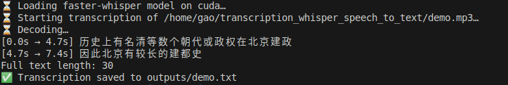

# Readme
This repo shows a demo to use openai-whisper to transcribe Speech to Text.

## Install openai-whisper
pip install openai-whisper
pip install faster-whisper

sudo apt update
sudo apt install -y ffmpeg

## Enable GPU
Install CUDA PyTorch:
pip install torch torchvision torchaudio --index-url https://download.pytorch.org/whl/cu118

## Install NVIDIA cuDNN
wget https://developer.download.nvidia.com/compute/cudnn/9.11.0/local_installers/cudnn-local-repo-debian12-9.11.0_1.0-1_amd64.deb
sudo dpkg -i cudnn-local-repo-debian12-9.11.0_1.0-1_amd64.deb
sudo cp /var/cudnn-local-repo-debian12-9.11.0/cudnn-*-keyring.gpg /usr/share/keyrings/
sudo apt-get update
sudo apt-get -y install cudnn
sudo apt-get -y install cudnn-cuda-12

## Model Size
Model Sizes: "tiny", "base", "small", "medium", "large". Larger models are more accurate but slower

## To run
python transcribe.py
python fast_transcribe.py

